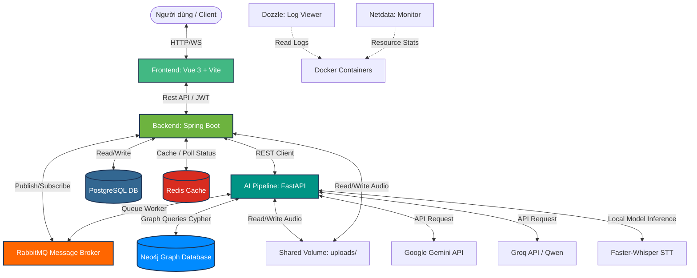

# 🤖 AI Tutor

<p align="center">
  
  
  
  
  
</p>

<p align="center">
  
  
  
  
</p>

---

## 📝 Giới Thiệu Dự Án

**AI Tutor** là một nền tảng học tập thông minh và cá nhân hóa ngôn ngữ, được thiết kế theo kiến trúc Microservices/Service-Oriented. Hệ thống tích hợp sâu các mô hình trí tuệ nhân tạo (LLM, STT, TTS), cơ sở dữ liệu đồ thị ngữ nghĩa (Graph Database - Neo4j) để thực hiện GraphRAG hỗ trợ dịch chuyên ngành chuẩn xác, kết hợp với thuật toán Spaced Repetition (Lặp lại ngắt quãng SM-2) để tối ưu hóa quá trình học flashcard và từ vựng.

Dự án bao gồm 3 thành phần chính:
1. **Frontend**: Phát triển bằng **Vite + Vue.js 3**, giao diện trực quan, hỗ trợ ghi âm trực tiếp, học flashcard tương tác.
2. **Backend**: Phát triển bằng **Spring Boot (Java 17)**, chịu trách nhiệm quản lý nghiệp vụ, xác thực JWT, chấm điểm SM-2, quản lý lịch sử học viên và hàng đợi.
3. **AI Pipeline**: Phát triển bằng **FastAPI (Python)**, điều phối pipeline LLM (Google Gemini / Groq), thực hiện GraphRAG trích xuất ngữ cảnh Neo4j, Speech-to-Text (STT) với Faster-Whisper và Text-to-Speech (TTS).

---

## ✨ Các Tính Năng Nổi Bật

*   **🎙️ Tương Tác & Luyện Nói Bằng Giọng Nói (STT & TTS)**: Người dùng có thể trò chuyện trực tiếp với AI thông qua microphone. AI Pipeline sử dụng **Faster-Whisper (STT)** để chuyển âm thanh thành văn bản và phản hồi lại bằng giọng nói sinh từ **TTS**, đồng thời đánh giá lỗi phát âm, ngữ pháp hoặc ngữ nghĩa và gợi ý sửa lỗi chi tiết.
*   **🌐 Dịch Chuyên Ngành Với GraphRAG & LLM**: Trích xuất các khái niệm và mối quan hệ ngữ nghĩa từ cơ sở dữ liệu đồ thị **Neo4j** (Word Sense Disambiguation), kết hợp vào prompt ngữ cảnh gửi tới LLM (Gemini/Qwen) giúp tạo ra các bản dịch thuật ngữ chuyên ngành cực kỳ chuẩn xác và tự nhiên.
*   **📇 Hệ Thống Học Flashcard Tích Hợp SM-2 (Spaced Repetition)**: Tự động tính toán khoảng thời gian ôn tập tối ưu cho từng từ vựng dựa trên mức độ tiếp thu và lịch sử đánh giá của người học, giảm thiểu tối đa hiện tượng quên kiến thức.
*   **📖 Tự Động Sinh Bài Tập & Câu Chuyện AI**: Phân tích lịch sử lỗi sai (phát âm chưa chuẩn, trả lời từ vựng sai) của người học để tự động tạo ra câu hỏi trắc nghiệm hoặc một câu chuyện ngữ cảnh chứa các từ vựng yếu đó nhằm củng cố kiến thức.
*   **⚡ Xử Lý Bất Đồng Bộ Với RabbitMQ & Caching Redis**: Các tác vụ AI nặng (như sinh câu chuyện dài, tổng hợp giọng nói phức tạp) được đẩy vào hàng đợi RabbitMQ để công nhân (worker) xử lý bất đồng bộ, sử dụng Redis lưu trữ tạm trạng thái kết quả và cache dữ liệu giúp tăng tốc độ phản hồi REST API.

---

## 🏗️ Sơ Đồ Kiến Trúc Hệ Thống

Dưới đây là mô hình tương tác giữa các dịch vụ trong hệ thống:



---

## 📂 Cấu Trúc Mã Nguồn

```text
.
├── ai/
│   └── python_pipeline/       # AI Pipeline code (FastAPI, LLM clients, STT/TTS adapters, Neo4j queries)
├── backend/                   # Backend Java Spring Boot (logic nghiệp vụ, API endpoints, SM-2 engine)
├── frontend/                  # Frontend Vue 3 + Vite (Giao diện người dùng, ghi âm, học tập)
├── docs/                      # Tài liệu đặc tả API và lược đồ cơ sở dữ liệu
├── latex_thesis/              # File mã nguồn báo cáo LaTeX (nếu có)
├── run_all.sh                 # Script chạy nhanh cả 3 service ở local (Dev mode)
├── docker-compose.yml         # File Docker Compose chạy môi trường phát triển / cục bộ
├── docker-compose.prod.yml    # File Docker Compose chạy môi trường Production (cho VPS)
├── .env                       # File cấu hình biến môi trường chung (database, API Keys)
└── HUONG_DAN_CAI_DAT.md       # Tài liệu chi tiết cấu hình và cài đặt thủ công
```

---

## ⚙️ Cấu Hình Biến Môi Trường (`.env`)

Tạo một file `.env` tại thư mục gốc của dự án với các thông số mẫu dưới đây (hoặc điều chỉnh phù hợp với tài nguyên của bạn):

```env
# Cấu hình PostgreSQL
POSTGRES_USER=postgres
POSTGRES_PASSWORD=123456
POSTGRES_DB=datn

# Cấu hình Neo4j
NEO4J_USER=neo4j
NEO4J_PASSWORD=12345678
NEO4J_DATABASE=datn-graph

# Cấu hình AI Pipeline Keys
GOOGLE_API_KEY=YOUR_GEMINI_API_KEY
GROQ_API_KEY=YOUR_GROQ_API_KEY
GROQ_MODEL=qwen/qwen3-32b
LLM_PROVIDER=gemini
LLM_MODEL=gemini-2.5-flash
STT_PROVIDER=faster-whisper

# Cấu hình Security JWT Backend
APP_JWT_SECRET=404E635266556A586E3272357538782F413F4428472B4B6250645367566B5970
APP_JWT_ACCESS_TOKEN_EXPIRATION=900000     # 15 Phút (ms)
APP_JWT_REFRESH_TOKEN_EXPIRATION=604800000 # 7 Ngày (ms)

# Cấu hình RabbitMQ Broker
RABBITMQ_USER=guest
RABBITMQ_PASSWORD=guest
```

---

## 🚀 Hướng Dẫn Khởi Chạy

Bạn có thể khởi chạy hệ thống bằng hai cách: sử dụng **Docker Compose (Khuyến nghị)** hoặc **Chạy thủ công từng thành phần (Chế độ Develop)**.

### Cách 1: Sử Dụng Docker Compose (Khuyến Nghị cho Triển Khai)

Đây là cách nhanh nhất và nhất quán nhất để thiết lập toàn bộ hạ tầng (PostgreSQL, Neo4j, Redis, RabbitMQ, Dozzle, Netdata) cùng các dịch vụ chính.

1.  Đảm bảo bạn đã cài đặt Docker và Docker Compose trên máy.
2.  Điền các API keys cần thiết vào file `.env` ở gốc thư mục.
3.  Chạy lệnh khởi động:
    ```bash
    docker compose up -d --build
    ```
4.  Docker sẽ tự động tải các service, xây dựng các Dockerfile nội bộ và khởi chạy các cổng:
    *   **Frontend**: `http://localhost` (Cổng 80)
    *   **Backend API**: `http://localhost:8080`
    *   **AI FastAPI**: `http://localhost:8001`
    *   **Neo4j Browser**: `http://localhost:7474`
    *   **RabbitMQ Dashboard**: `http://localhost:15672` (Tài khoản: `guest`/`guest`)
    *   **Dozzle Log Viewer**: `http://localhost:8888` (Xem log thời gian thực)
    *   **Netdata Monitoring**: `http://localhost:19999` (Giám sát tài nguyên máy chủ)

---

### Cách 2: Khởi Chạy Từng Thành Phần (Dành Cho Phát Triển - Local Dev)

Trước khi chạy, hãy cài đặt các dịch vụ cần thiết (PostgreSQL, Neo4j, Redis, RabbitMQ) cục bộ trên máy của bạn và chạy chúng.

#### 1. Khởi chạy AI Pipeline (FastAPI)
```bash
cd ai/python_pipeline
python3 -m venv .venv
source .venv/bin/activate
pip install -r requirements.txt
# Copy file .env và điền các API Key
cp ../../.env .env
# Khởi chạy server
uvicorn server:app --host 0.0.0.0 --port 8001
```

#### 2. Khởi chạy Spring Boot Backend
```bash
cd backend
# Xây dựng file JAR
./mvnw clean package -DskipTests
# Chạy Spring Boot
./mvnw spring-boot:run
```

#### 3. Khởi chạy Vue Frontend
```bash
cd frontend
npm install
npm run dev
```
Trình duyệt của bạn sẽ tự động mở hoặc truy cập: `http://localhost:5173`.

#### 💡 Chạy Nhanh Bằng Run Script
Nếu bạn đã thiết lập xong môi trường Python và Node modules cho Frontend, chỉ cần chạy script gộp tiện lợi:
```bash
chmod +x run_all.sh
./run_all.sh
```
Script sẽ khởi chạy đồng thời cả 3 dịch vụ chính dưới nền và lưu log vào từng file log tương ứng (`server.log`, `backend.log`, `frontend.log`).

---

## 📊 Khởi Tạo Cơ Sở Dữ Liệu (Database Seeding)

### 1. Nạp Dữ Liệu Từ Điển Đồ Thị Vào Neo4j (GraphRAG)
Dự án có sẵn script import bộ dữ liệu mẫu vào Neo4j:
```bash
cd ai/scripts/seed_neo4j
pip install -r requirements.txt
python main.py --skip-translate
```
Script này sẽ kết nối đến Neo4j qua cấu hình `bolt://localhost:7687` và nạp các thực thể từ vựng, ngữ nghĩa cùng mối quan hệ để phục vụ tính năng dịch thuật.

### 2. Khôi Phục Dữ Liệu PostgreSQL (Nếu có)
Nếu có file sao lưu cơ sở dữ liệu `postgres_backup.sql` ở thư mục gốc, bạn có thể phục hồi nhanh vào container PostgreSQL:
```bash
docker exec -i datn-postgres psql -U postgres -d datn < postgres_backup.sql
```

---

## 🔄 Quy Trình CI/CD (GitHub Actions)

Dự án tích hợp sẵn quy trình CI/CD tự động hóa trong file `.github/workflows/deploy-registry.yml`:
1.  **Build & Push**: Mỗi khi push code lên nhánh `main`, hệ thống tự động build Docker Image cho 3 dịch vụ (Frontend, Backend, AI Pipeline).
2.  **GitHub Container Registry (GHCR)**: Đẩy các image đã build lên registry `ghcr.io`.
3.  **SSH Deploy**: Kết nối trực tiếp vào VPS qua SSH, đồng bộ file `docker-compose.prod.yml`, pull image mới nhất và restart lại dịch vụ một cách an toàn mà không làm gián đoạn database (`up -d --remove-orphans`).

---

## 🛠️ Giám Sát Và Vận Hành (Operations & Monitoring)

Khi chạy hệ thống trong môi trường sản xuất (hoặc qua Docker Compose), bạn có thể truy cập các dashboard hỗ trợ quản lý vận hành:
*   **Netdata (Giám sát tài nguyên)**: Xem trực quan biểu đồ CPU, RAM, Disk, Traffic mạng và hiệu suất container tại `http://<ip-cua-ban>:19999`.
*   **Dozzle (Xem log container)**: Không cần phải SSH và gõ `docker logs`, truy cập giao diện web `http://<ip-cua-ban>:8888` để xem, tìm kiếm và lọc log trực tiếp của bất cứ service nào đang chạy.
*   **RabbitMQ Management**: Kiểm tra tình trạng hàng đợi, lượng message đang chờ xử lý tại `http://<ip-cua-ban>:15672`.

---

## 📞 Liên Hệ & Bản Quyền

Mọi thắc mắc hoặc yêu cầu đóng góp vui lòng liên hệ:
*   **Người thực hiện**: Trần Doãn Huy
*   **Email**: [huytd2004@gmail.com](mailto:huytd2004@gmail.com)
*   **Repository**: [huytd2004/DATN](https://github.com/huytd2004/DATN)
