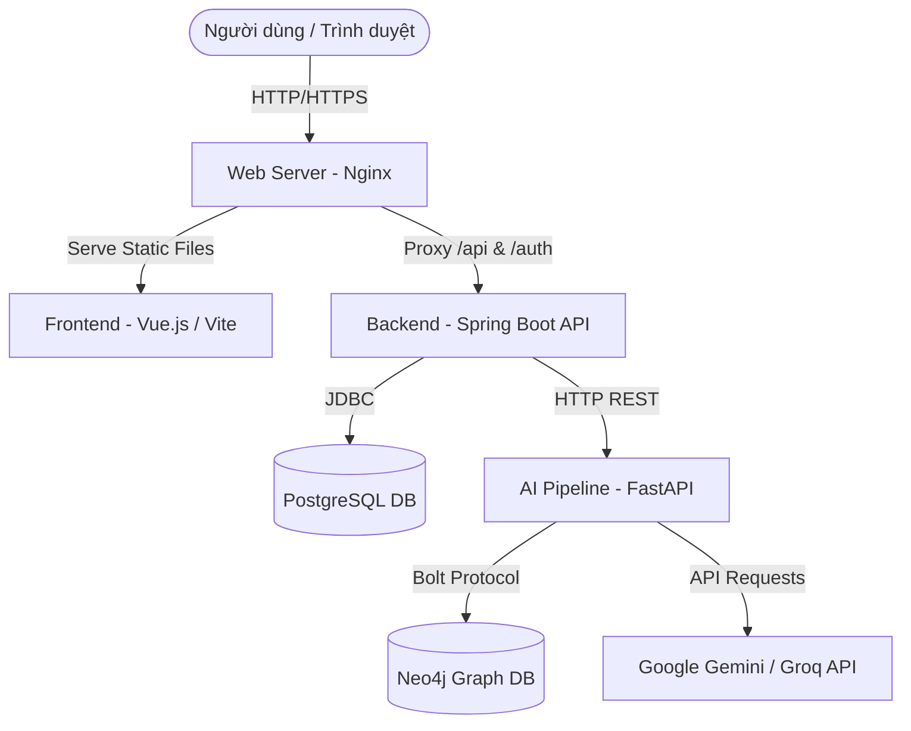

# Hướng dẫn Triển khai Hệ thống AI Tutor (Đồ án Tốt nghiệp)

Tài liệu này cung cấp hướng dẫn chi tiết về các phương án triển khai (deploy) hệ thống **AI Tutor** lên môi trường Production (ví dụ: VPS Ubuntu).

---

## 1. Sơ đồ Kiến trúc & Phân tích Đánh giá

Hệ thống gồm 5 thành phần chính hoạt động độc lập (Decoupled Microservices) và giao tiếp qua API:



### Cải tiến kiến trúc (Decoupling REST API):

- **Trước đây:** Spring Boot khởi chạy trực tiếp tiến trình CLI Python (`python_pipeline.runner`) thông qua lớp `ProcessBuilder`. Việc này bắt buộc máy chủ chạy Java phải có sẵn môi trường Python và cài đặt đầy đủ thư viện NLP/ML cồng kềnh, khiến việc triển khai rất phức tạp.
- **Hiện tại (Đã tối ưu hóa):**
  1. Đã tích hợp tính năng dịch thuật chuyên sâu vào một endpoint REST API mới trên FastAPI Server: `POST /v1/translate/deep`.
  2. Spring Boot Backend giao tiếp với AI Pipeline qua HTTP REST (sử dụng `HttpClient`), loại bỏ hoàn toàn mã nguồn khởi chạy CLI cũ.
  3. **Lợi ích:** Tách biệt hoàn toàn phần Backend (chỉ cần cài Java 21, dung lượng container nhỏ gọn ~150MB) và AI Pipeline (chạy môi trường Python ~500MB). Hệ thống dễ dàng triển khai, mở rộng và bảo trì.

---

## 2. Phương án 1: Triển khai bằng Docker & Docker Compose (Khuyên dùng)

Đây là cách tiêu chuẩn, nhanh chóng và ít xảy ra lỗi do xung đột môi trường nhất.

### 2.1. Cấu trúc thư mục Docker cần chuẩn bị

Bạn có thể tạo các file Dockerfile trong từng thư mục dự án tương ứng.

#### A. Frontend Dockerfile (`frontend/Dockerfile`)

Tận dụng Nginx để build và serve ứng dụng Vue:

```dockerfile
# Step 1: Build
FROM node:20-alpine AS build-stage
WORKDIR /app
COPY package*.json ./
RUN npm install
COPY . .
RUN npm run build

# Step 2: Serve
FROM nginx:stable-alpine AS production-stage
COPY --from=build-stage /app/dist /usr/share/nginx/html
# Sao chép cấu hình Nginx custom
COPY nginx.conf /etc/nginx/conf.d/default.conf
EXPOSE 80
CMD ["nginx", "-g", "daemon off;"]
```

_Tạo thêm file cấu hình Nginx cho Frontend tại `frontend/nginx.conf`:_

```nginx
server {
    listen 80;
    server_name localhost;

    location / {
        root /usr/share/nginx/html;
        index index.html index.htm;
        try_files $uri $uri/ /index.html;
    }

    # Proxy các request API đến Spring Boot Backend
    location /api {
        proxy_pass http://backend:8080;
        proxy_set_header Host $host;
        proxy_set_header X-Real-IP $remote_addr;
        proxy_set_header X-Forwarded-For $proxy_add_x_forwarded_for;
    }

    location /auth {
        proxy_pass http://backend:8080;
        proxy_set_header Host $host;
        proxy_set_header X-Real-IP $remote_addr;
        proxy_set_header X-Forwarded-For $proxy_add_x_forwarded_for;
    }
}
```

#### B. Backend Dockerfile (`backend/Dockerfile`)

```dockerfile
FROM maven:3.9.6-eclipse-temurin-21 AS build
WORKDIR /app
COPY pom.xml .
COPY src ./src
RUN mvn clean package -DskipTests

FROM eclipse-temurin:21-jre-alpine
WORKDIR /app
COPY --from=build /app/target/backend-0.0.1-SNAPSHOT.jar app.jar
# Tạo thư mục lưu trữ file audio upload
RUN mkdir -p uploads/tutor-audio
EXPOSE 8080
ENTRYPOINT ["java", "-jar", "app.jar"]
```

#### C. AI Pipeline Dockerfile (`ai/python_pipeline/Dockerfile`)

```dockerfile
FROM python:3.10-slim

WORKDIR /app

# Cài đặt các thư viện hệ thống cần thiết (nếu có)
RUN apt-get update && apt-get install -y --no-install-recommends \
    build-essential \
    && rm -rf /var/lib/apt/lists/*

COPY requirements.txt .
RUN pip install --no-cache-dir -r requirements.txt

COPY . .

EXPOSE 8001
CMD ["uvicorn", "server:app", "--host", "0.0.0.0", "--port", "8001"]
```

---

### 2.2. File cấu hình Docker Compose (`docker-compose.yml`)

Tạo file `docker-compose.yml` ở thư mục gốc của toàn bộ dự án (`DATN/`):

```yaml
version: "3.8"

services:
  # 1. Database PostgreSQL
  postgres:
    image: postgres:15-alpine
    container_name: datn-postgres
    restart: always
    environment:
      POSTGRES_DB: datn
      POSTGRES_USER: postgres
      POSTGRES_PASSWORD: your_secure_password # Thay đổi mật khẩu của bạn
    ports:
      - "5432:5432"
    volumes:
      - postgres_data:/var/lib/postgresql/data

  # 2. Graph Database Neo4j
  neo4j:
    image: neo4j:5-community
    container_name: datn-neo4j
    restart: always
    ports:
      - "7474:7474" # Neo4j Browser HTTP
      - "7687:7687" # Bolt protocol
    environment:
      - NEO4J_AUTH=neo4j/your_secure_neo4j_password # Thay đổi password (>= 8 ký tự)
    volumes:
      - neo4j_data:/data
      - neo4j_import:/import

  # 3. AI Pipeline (FastAPI)
  ai-pipeline:
    build:
      context: ./ai/python_pipeline
    container_name: datn-ai-pipeline
    restart: always
    ports:
      - "8001:8001"
    environment:
      - LLM_PROVIDER=gemini
      - LLM_MODEL=gemini-2.5-flash
      - GOOGLE_API_KEY=AIzaSyCJ8JP... # API Key của bạn
      - NEO4J_URI=bolt://neo4j:7687
      - NEO4J_USER=neo4j
      - NEO4J_PASS=your_secure_neo4j_password
      - NEO4J_DATABASE=neo4j # Mặc định trên container community
      - STT_PROVIDER=faster-whisper
    depends_on:
      - neo4j
    volumes:
      - shared_uploads:/app/uploads # Để chia sẻ file âm thanh nếu cần

  # 4. Spring Boot Backend
  backend:
    build:
      context: ./backend
    container_name: datn-backend
    restart: always
    ports:
      - "8080:8080"
    environment:
      - SPRING_DATASOURCE_URL=jdbc:postgresql://postgres:5432/datn
      - SPRING_DATASOURCE_USERNAME=postgres
      - SPRING_DATASOURCE_PASSWORD=your_secure_password
      - APP_TUTOR_AI_BASE-URL=http://ai-pipeline:8001
      - APP_TUTOR_BROWSER-TTS=true
    depends_on:
      - postgres
      - ai-pipeline
    volumes:
      - shared_uploads:/app/uploads

  # 5. Frontend (Nginx serve Vue)
  frontend:
    build:
      context: ./frontend
    container_name: datn-frontend
    restart: always
    ports:
      - "80:80"
    depends_on:
      - backend

volumes:
  postgres_data:
  neo4j_data:
  neo4j_import:
  shared_uploads:
```

### 2.3. Các bước chạy hệ thống với Docker Compose:

1. Sửa đổi các file cấu hình và thay thế các biến môi trường thực tế (API Keys, Mật khẩu).
2. Chạy lệnh để build và khởi chạy tất cả các dịch vụ dưới dạng chạy ngầm (background):
   ```bash
   docker-compose up -d --build
   ```
3. Xem log của hệ thống để debug nếu có lỗi:
   ```bash
   docker-compose logs -f
   ```
4. Truy cập IP của server VPS tại cổng `80` (hoặc domain đã trỏ về VPS).

---

## 3. Phương án 2: Triển khai thủ công trực tiếp trên VPS Ubuntu (Traditional VPS Deployment)

Phương án này phù hợp khi bạn muốn quản lý trực tiếp các tiến trình (process) bằng Systemd trên hệ thống Linux.

### 3.1. Cài đặt các công cụ cần thiết trên VPS

Cập nhật package list và cài đặt Java 21, Node.js 18, Python 3.10, PostgreSQL, Neo4j, và Nginx:

```bash
sudo apt update && sudo apt upgrade -y

# 1. Cài đặt Java 21
sudo apt install openjdk-21-jdk openjdk-21-jre -y

# 2. Cài đặt Node.js 18
curl -fsSL https://deb.nodesource.com/setup_18.x | sudo -E bash -
sudo apt install -y nodejs

# 3. Cài đặt Python 3 & pip & venv
sudo apt install python3 python3-pip python3-venv -y

# 4. Cài đặt PostgreSQL
sudo apt install postgresql postgresql-contrib -y
sudo systemctl start postgresql
sudo systemctl enable postgresql

# 5. Cài đặt Nginx
sudo apt install nginx -y
sudo systemctl start nginx
sudo systemctl enable nginx
```

### 3.2. Thiết lập cơ sở dữ liệu

- **PostgreSQL:**
  ```bash
  sudo -i -u postgres psql
  ```
  Trong giao diện SQL, tạo database và tài khoản:
  ```sql
  CREATE DATABASE datn;
  CREATE USER datn_user WITH PASSWORD 'your_secure_password';
  GRANT ALL PRIVILEGES ON DATABASE datn TO datn_user;
  \q
  ```
- **Neo4j:** Cài đặt Neo4j bằng cách làm theo hướng dẫn cài đặt APT chính thức của Neo4j. Sau đó khởi động dịch vụ:
  ```bash
  sudo systemctl start neo4j
  sudo systemctl enable neo4j
  ```

---

### 3.3. Build & Cấu hình các dịch vụ chạy ngầm (Systemd Service)

#### A. Triển khai AI Pipeline (Python FastAPI)

1. Clone source code về thư mục `/var/www/datn-system`.
2. Tạo môi trường ảo Python và cài đặt thư viện:
   ```bash
   cd /var/www/datn-system/ai/python_pipeline
   python3 -m venv .venv
   source .venv/bin/activate
   pip install -r requirements.txt
   ```
3. Tạo file cấu hình môi trường `.env` trong thư mục này với các thông số thực tế của bạn.
4. Thiết lập Systemd service chạy FastAPI tại `/etc/systemd/system/datn-ai.service`:

   ```ini
   [Unit]
   Description=FastAPI AI Pipeline for DATN
   After=network.target

   [Service]
   User=ubuntu
   WorkingDirectory=/var/www/datn-system/ai/python_pipeline
   ExecStart=/var/www/datn-system/ai/python_pipeline/.venv/bin/uvicorn server:app --host 127.0.0.1 --port 8001
   Restart=always

   [Install]
   WantedBy=multi-user.target
   ```

5. Kích hoạt dịch vụ:
   ```bash
   sudo systemctl daemon-reload
   sudo systemctl start datn-ai
   sudo systemctl enable datn-ai
   ```

#### B. Triển khai Spring Boot Backend

1. Build dự án jar ở máy local hoặc trực tiếp trên VPS:
   ```bash
   cd /var/www/datn-system/backend
   ./mvnw clean package -DskipTests
   ```
2. Tạo file cấu hình môi trường production bên cạnh file jar hoặc truyền trực tiếp qua Systemd service.
3. Thiết lập Systemd service chạy Backend tại `/etc/systemd/system/datn-backend.service`:

   ```ini
   [Unit]
   Description=Spring Boot Backend for DATN
   After=network.target postgresql.service

   [Service]
   User=ubuntu
   WorkingDirectory=/var/www/datn-system/backend
   ExecStart=/usr/bin/java -jar target/backend-0.0.1-SNAPSHOT.jar \
     --spring.datasource.url=jdbc:postgresql://localhost:5432/datn \
     --spring.datasource.username=datn_user \
     --spring.datasource.password=your_secure_password \
     --app.tutor.ai-base-url=http://127.0.0.1:8001 \
     --app.tutor.browser-tts=true
   Restart=always

   [Install]
   WantedBy=multi-user.target
   ```

4. Kích hoạt dịch vụ:
   ```bash
   sudo systemctl daemon-reload
   sudo systemctl start datn-backend
   sudo systemctl enable datn-backend
   ```

#### C. Triển khai Frontend (Nginx làm Web Server)

1. Build Frontend trên máy cá nhân hoặc VPS:
   ```bash
   cd /var/www/datn-system/frontend
   npm install
   npm run build
   ```
   Kết quả sinh ra thư mục `/var/www/datn-system/frontend/dist`.
2. Tạo cấu hình Nginx để host Frontend và làm Reverse Proxy cho Backend tại `/etc/nginx/sites-available/datn`:

   ```nginx
   server {
       listen 80;
       server_name your_domain.com; # Thay thế bằng domain hoặc IP của bạn

       # Serve tĩnh của Frontend
       location / {
           root /var/www/datn-system/frontend/dist;
           index index.html index.htm;
           try_files $uri $uri/ /index.html;
       }

       # Proxy API requests to Spring Boot
       location /api {
           proxy_pass http://127.0.0.1:8080;
           proxy_set_header Host $host;
           proxy_set_header X-Real-IP $remote_addr;
           proxy_set_header X-Forwarded-For $proxy_add_x_forwarded_for;
           proxy_set_header X-Forwarded-Proto $scheme;
       }

       location /auth {
           proxy_pass http://127.0.0.1:8080;
           proxy_set_header Host $host;
           proxy_set_header X-Real-IP $remote_addr;
           proxy_set_header X-Forwarded-For $proxy_add_x_forwarded_for;
           proxy_set_header X-Forwarded-Proto $scheme;
       }
   }
   ```

3. Kích hoạt site mới và reload Nginx:
   ```bash
   sudo ln -s /etc/nginx/sites-available/datn /etc/nginx/sites-enabled/
   sudo rm /etc/nginx/sites-enabled/default # Xóa cấu hình mặc định nếu có
   sudo nginx -t # Kiểm tra lỗi cú pháp
   sudo systemctl restart nginx
   ```

---

## 5. Hướng dẫn Seeding Dữ liệu trên Production

Sau khi triển khai các cơ sở dữ liệu thành công trên VPS:

1. Đảm bảo rằng cơ sở dữ liệu PostgreSQL đã được tự động tạo bảng (khi Spring Boot chạy lần đầu tiên với `ddl-auto: update`).
2. Tiến hành seed dữ liệu vào Neo4j bằng cách chạy script import:
   ```bash
   cd /var/www/datn-system/ai/scripts/seed_neo4j
   source ../../python_pipeline/.venv/bin/activate
   pip install -r requirements.txt
   python main.py --skip-translate
   ```
   _(Script này sẽ import các từ chuyên ngành và các quan hệ ngôn ngữ từ file JSON thô vào đồ thị của Neo4j)._
